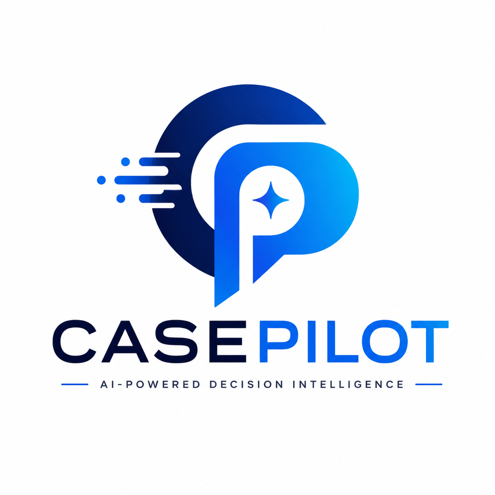

<p align="center">
  
</p>

<h1 align="center">CasePilot</h1>

<p align="center">
AI-Powered Decision Intelligence for Customer Operations
</p>

<p align="center">
Transform unstructured business communications into explainable insights, intelligent prioritization, and actionable decisions using Google Gemini, Google Cloud, and NVIDIA RAPIDS.
</p>

---

## Overview

Modern organizations generate an overwhelming amount of unstructured information—emails, requests, reports, alerts, approvals, and conversations.

While Generative AI can summarize this information, teams still face critical questions:

- What requires immediate attention?
- Which items carry the highest business risk?
- Where should resources be allocated first?
- Which decisions should be made today?

CasePilot is an AI-powered Decision Intelligence Platform that transforms unstructured business communications into structured intelligence, computes transparent business risk scores, prioritizes work based on explainable logic, and delivers actionable insights through an interactive dashboard.

Rather than replacing human decision-makers, CasePilot augments operational teams with AI-assisted prioritization and explainable recommendations.
---

# Architecture

```
             Business Communications
                      │
                      ▼
              Data Ingestion Layer
                      │
                      ▼
          Google Gemini Structuring
                      │
                      ▼
          Structured Business Records
                      │
                      ▼
       Explainable Decision Intelligence
                      │
                      ▼
      Risk Classification & Prioritization
                      │
            ┌─────────┴─────────┐
            ▼                   ▼
     NVIDIA RAPIDS       Streamlit Dashboard
      GPU Analytics      Decision Console
```

---

# Features

### AI-powered Case Structuring

*Google Gemini* extracts structured intelligence including:

- Category
- Priority
- Sentiment
- Business Impact
- Root Cause
- AI Summary
- Recommended Action
- Confidence Score
- Named Entities

---

### Explainable Risk Scoring

Instead of relying solely on LLM outputs, CasePilot combines AI with deterministic business rules to compute a transparent **Health Score (0–100)**.

Factors include:

- Urgency
- Sentiment
- Business Impact
- Historical Context
- AI Confidence

Cases are then classified into:

- High Risk
- Medium Risk
- Low Risk

---

### Interactive Decision Dashboard

The Streamlit dashboard provides:

- Executive KPI Cards
- Risk Distribution
- Issue Category Analytics
- Health Score Distribution
- AI-generated Operational Insights
- Searchable Case Explorer
- Detailed Case View
- Gemini-powered Resolution Suggestions
- AI-generated Response Drafts

---

### NVIDIA RAPIDS Acceleration

To demonstrate enterprise scalability, CasePilot includes GPU-accelerated analytics using **NVIDIA RAPIDS cuDF**.

A synthetically expanded dataset (100K rows) is included to benchmark common analytical operations against pandas.

The benchmark performs:

- Aggregations
- GroupBy
- Sorting
- Category Analytics
- Risk Distribution

---

# Technology Stack

## Google Cloud

- Google Gemini
- Gmail API
- Cloud Storage (dataset hosting)

## NVIDIA

- RAPIDS cuDF

## Python

- Streamlit
- Plotly
- Pandas
- NumPy

---

# Repository Structure

```
CasePilot/

├── app.py
├── benchmark.py
├── gmail_ingest.py
├── gemini_structure.py
├── scoring.py
├── export_results.py
├── upscale_data.py
├── generate_dummy_cases.py

├── CasePilot.ipynb

├── casepilot_scored_cases.csv
├── casepilot_structured_cases.csv
├── casepilot_scaled_100k.csv

├── requirements.txt
├── README.md
├── logo.png

└── casepilot-auth/
    └── authorize.py
```

---

# Dataset

The repository contains three datasets:

| File | Description |
|------|-------------|
| casepilot_structured_cases.csv | AI-structured customer support cases |
| casepilot_scored_cases.csv | Final explainable scoring output |
| casepilot_scaled_100k.csv | Synthetic dataset for RAPIDS benchmarking |

The original benchmark was executed on a **2 million row** synthetic dataset, which is intentionally excluded from the repository due to size constraints.

---

# Running the Dashboard

Install dependencies

```bash
pip install -r requirements.txt
```

Launch the application

```bash
streamlit run app.py
```

---

# Running the Benchmark

```bash
python benchmark.py
```

For GPU acceleration, install RAPIDS separately on a supported CUDA environment.

---

# Explainable Health Score

Health Score is computed using a transparent rules engine.

Factors include:

- Urgency
- Business Impact
- Customer Sentiment
- Repeat Complaint Frequency
- AI Confidence

Unlike black-box AI scoring, every score can be traced back to explicit business logic.

---

# Why CasePilot?

Traditional support dashboards answer:

> What happened?

CasePilot answers:

> What should we do next?

By combining LLM-based understanding with deterministic business rules, CasePilot helps support teams prioritize work, reduce escalations, and make faster operational decisions.

---

# Future Improvements

- Vertex AI integration
- BigQuery analytics
- Multi-agent workflows
- Automatic SLA prediction
- Customer churn prediction
- Real-time Gmail monitoring
- Multi-channel support (Slack, Zendesk, Jira)

---

# Built For

**Google Cloud × NVIDIA AI Open Hackathon 2026**

CasePilot demonstrates how Google Gemini and NVIDIA RAPIDS can be combined to build intelligent, scalable decision-support systems for customer operations.

---

## License

MIT License.
